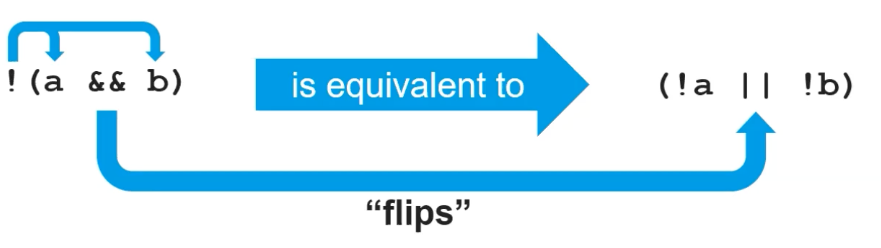
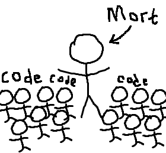
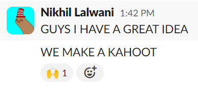
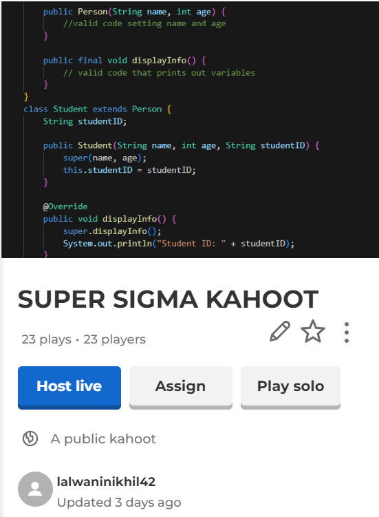
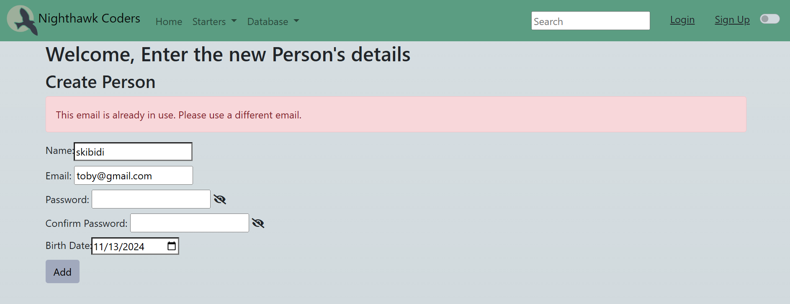
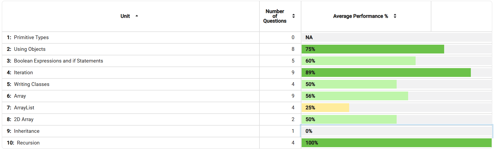
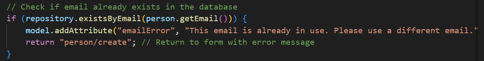
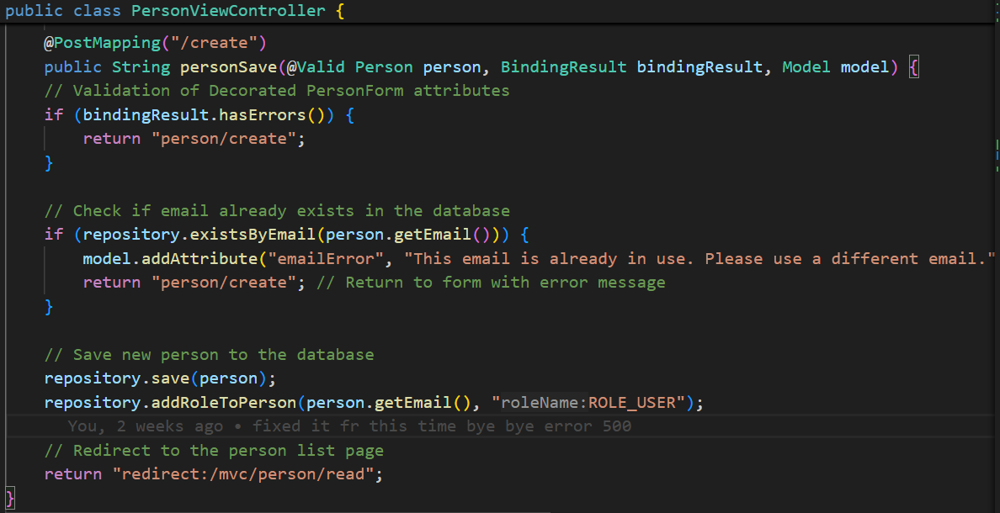
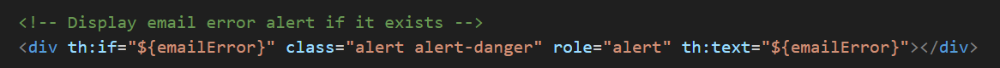

# Cyber Security Panel


## Notes: 

One of the biggest things to remember if considering a career in cybersecurity is to stay curious and not be afraid to try something off a hunch.

To be truly successful in the workforce you need to build a network of the best in their field
	- jobs
	- recommendation

It is important to have a technical background in IT to understand the systems that you are trying to defend.

0 day attacks target a vulnerability that cant be patched quickly

You need to be equally good with your people skills especially when talking to employers who wont understand specific technical Jargon.
	- looks for positions like scrum master and product manager to build these skills and the ability to present work to employers

**Certifications**: Look for CC (Certified Cybersecurity) certification

Cyber attacks especially ransom target Microsoft because of how prevalent it is in healthcare where people don't have time to try and solve due to lives being on the line. 


# The Alumni Panel

## Matthew, Arthur and I being showers at the panel and sitting in the front 😎
## Notes

- It's equally important to learn to explain your code at a surface level as it is to write good code.
- Elevator pitch is a must
- Agile methodology and communication of work makes you very valuable to clubs
- get good at GitHub for projects
- project focused applications
- GET SENIOR FRIENDS FOR JOB REFERENCES


# methods HW

## Maze Solver:
```
public class MazeSolver {

    public static boolean solveMaze(char[][] maze, int startX, int startY) {
        if (maze[startX][startY] == '#' || maze[startX][startY] == 'x') {
            return false;
        }

        if (maze[startX][startY] == 'E') {
            return true;
        }

        // Mark the current cell as visited
        maze[startX][startY] = 'x';

        // try every direction
        boolean foundExit = solveMaze(maze, startX - 1, startY) || // up
                            solveMaze(maze, startX + 1, startY) || // down
                            solveMaze(maze, startX, startY - 1) || // left
                            solveMaze(maze, startX, startY + 1);   // right

        //reset
        maze[startX][startY] = ' ';

        return foundExit;
    }

    public static void main(String[] args) {
        char[][] maze = {
            {'#', '#', '#', '#', '#'},
            {'#', ' ', ' ', '#', 'E'},
            {'#', ' ', '#', ' ', '#'},
            {'#', ' ', ' ', ' ', '#'},
            {'#', '#', '#', '#', '#'}
        };

        System.out.println(solveMaze(maze, 1, 4));
    }
}


MazeSolver.main(null);
```


# What I've done so far

## Week 1

There was a lot of learning this week. I set up my page and downloaded all the tools. I also made a bash script to show tool versions and start the venv so I don't have to run each command individually.

Had to create a Github access key to push to my own repo.
-   did this 3 times because I kept changing my repo name
    git remote add origin https://<TOKEN>@github.com/<REPO-OWNER-USERNAME>/<REPO-NAME>

### lots of terminal stuff:
- Learned about giving execute permissions with chmod
- Renaming files and moving them around

## Week 2-3

### Custom theme for my site
I modified the default minima leaf theme to have different colors that I liked. It's still a bit dark for my liking so I might change that.

### First time using HTML
Made a program to fly text across the screen with motivational quotes. I added a user input field to add to the quote list. 
- Lots of ChatGPT and Stack Overflow involved. 
- still not entirely confident with HTML.
 
## Notes
- use java 17

## Week 4

### Animated images on about page

### Car game
still needs improvement ie textures and stuff


### Cookie Clicker Pair Project
added an upgrade button


# Team Teaches

1. Learn Units #1-#10 from the College Board.
2. Build a lesson using Java for each of the topics provided by the teacher’s starters.
3. The lesson should include a Tech Talk portion, popcorn hacks, and homework hacks. The lesson should NOT have more than 5 minutes of talking before engaging students in an activity (e.g., popcorn hacks).
3. Be prepared to grade homework. This means having a plan for homework and a plan for grading the homework. You will grade on a “1-point” scale. 
4. Weight popcorn hacks and homework hacks in the grading.
5. Lesson time will be between 20 and 30 minutes. Homework time should be about the same as lesson time.


## Unit 2 Classes takeaways

Classes are the basis of all OOP in Java

Classes can have multiple constructors

They can also have methods that are a part of the Classes

primitive types are usually lowercase while their wrapped counterparts are capatalized ie. Integer

## Unit 3 Booleans takeaways

Boolean logic is pretty standard between langages

Conditions in java follow the format:
`if (condition) {output}`

Most of the stuff is pretty standard

One thing that I thought was interesting was how inverting booleans follows De Morgan's law


## Unit 4 Iteration takeaways

Also quite similar to Python

For loops
`for(int i = 0; i < array.length; i++){do stuff}`

While Loops
`while(i < 10){do stuff}`

the `charAt(index)` can be used to iterate through strings

## Unit 5 Classes takeaways

Classes are essential to OOP
This is the notation to create a class:

```
public class Car {
    // Attributes of the car
    private String make;
    private String model;
    private int year;
    private double mileage;

    // Constructor 1: Default constructor
    public Car() {
        this.make = "Unknown";
        this.model = "Unknown";
        this.year = 0;
        this.mileage = 0.0;
    }

    // Constructor 2: Parameterized constructor
    public Car(String make, String model, int year, double mileage) {
        this.make = make;
        this.model = model;
        this.year = year;
        this.mileage = mileage;
    }

    // Method to display the car details
    public void displayCarInfo() {
        System.out.println("Car Make: " + make);
        System.out.println("Car Model: " + model);
        System.out.println("Year: " + year);
        System.out.println("Mileage: " + mileage + " miles");
    }
}
```

Classes let us reuse code and help with abstraction.


## Unit 6 Arrays takeaways

Creating an array: `int [] array1 = new int[5]`

No negatative indexing (unlike python)

Arrays have a set size that is defined at their creation

You can use for loops and advanced for loops to iterate through Arrays
  **Note you can not modify elements of array when using advanced for loop**

## Unit 7 Arraylists takeaways

importing Arraylist: `import java.util.ArrayList;`

create a new arraylist: `ArrayList<Integer> numbersList = new ArrayList<>();`

Arraylists are like Java's version of Python lists. 

They have methods like:

- .size()

- .remove()

- .add()

that have similar functionality to Python lists

They are also not limited in size the same way arrays are. 

## Unit 8 2D Arrays takeaways

2D arrays are just nested arrays. 

How to create a nested array:

```
int[][] array = {
            {90, 85, 88, 92}, 
            {75, 80, 78, 85},
            {60, 65, 70, 75}
        };

```

These can be useful for creating grids

## Unit 9 Inheritence takeaways 

Our lesson!

Inheritence very importent for abstraction

How to inherit from a class: 

'''
public class Triangle extends Shape
'''

Remember to use `@Override` keyword when overriding methods

`super()` takes attributes from the parent class


## Memory From Presentation



  My attempt at an analogy between Mr. Mortensen and Inheritence did not go as planned and everyone in the class started laughing. 
  I think it did end up being a good refresher in the middle of the lesson to keep it more light hearted. 


## Beyond Perfunctory

We made a team kahoot for review on the topic since it can be difficult. 




## Relevancy

Unit 7 **Arraylists** was probably the most significant thing I learned throughout the lessons. It was really the moment where I felt like I could actually code in Java. 

Prior to this I had just assumed that Java's only equivalent to Python's list was an array. I couldn't wrap my head around how so many of the programs I had written in Python would even work in Java without being able to add, access, and modify elements to an ever growing list. 

Participating in the lesson on Arraylists showed me that all of this was possible in Java and helped me gain the confidence to write my own programs in Java. 


## Proof of learning

```
public class Grid {
    private int length;
    private int width;
    private String name;
    private char[][] grid;

    public Grid(int length, int width, String name) {
        this.length = length;
        this.width = width;
        this.name = name;
        grid = new char[length][width];
    }

    public void setCharAt(int row, int col, char ch) {
        if (row >= 0 && row < length && col >= 0 && col < width) {
            grid[row][col] = ch;
        } else {
            System.out.println("Invalid position.");
        }
    }

    public void printGrid() {

        System.out.println(this.name);

        for (int i = 0; i < width; i++) {
            System.out.print(" _");
        }
        System.out.println();
        
        for (int i = 0; i < length; i++) {
            for (int j = 0; j < width; j++) {
                System.out.print("|" + grid[i][j]);
            }
            System.out.println("|");
        }
        System.out.println();
    }
}

public class Main {
    public static void main(String[] args) {
        Grid ticTacToe = new Grid(3, 3, "Tic Tac Toe");

        ticTacToe.setCharAt(0, 0, 'X');
        ticTacToe.setCharAt(1, 1, 'O');
        ticTacToe.setCharAt(2, 0, 'X');

        ticTacToe.printGrid();

        Grid chess = new Grid(8, 8, "Chess");

        chess.setCharAt(7, 0, 'R');
        chess.setCharAt(7, 1, 'K');
        chess.setCharAt(7, 2, 'B');
        chess.setCharAt(7, 3, 'Q');
        chess.setCharAt(7, 4, 'W');
        chess.setCharAt(7, 5, 'B');
        chess.setCharAt(7, 6, 'K');
        chess.setCharAt(7, 7, 'R');

        chess.setCharAt(6, 0, 'P');
        chess.setCharAt(6, 1, 'P');
        chess.setCharAt(6, 2, 'P');
        chess.setCharAt(6, 3, 'P');
        chess.setCharAt(6, 4, 'P');
        chess.setCharAt(6, 5, 'P');
        chess.setCharAt(6, 6, 'P');
        chess.setCharAt(6, 7, 'P');

        chess.setCharAt(0, 0, 'r');
        chess.setCharAt(0, 1, 'k');
        chess.setCharAt(0, 2, 'b');
        chess.setCharAt(0, 3, 'q');
        chess.setCharAt(0, 4, 'w');
        chess.setCharAt(0, 5, 'b');
        chess.setCharAt(0, 6, 'k');
        chess.setCharAt(0, 7, 'r');

        chess.setCharAt(1, 0, 'p');
        chess.setCharAt(1, 1, 'p');
        chess.setCharAt(1, 2, 'p');
        chess.setCharAt(1, 3, 'p');
        chess.setCharAt(1, 4, 'p');
        chess.setCharAt(1, 5, 'p');
        chess.setCharAt(1, 6, 'p');
        chess.setCharAt(1, 7, 'p');

        chess.printGrid();
    }
}
Main.main(null);

```

Output creates game boards of varying sizes

```
Tic Tac Toe
 _ _ _ 
|X| | |
| |O| |
|X| | |

Chess
 _ _ _ _ _ _ _ _ 
|r|k|b|q|w|b|k|r|
|p|p|p|p|p|p|p|p|
| | | | | | | | |
| | | | |P| | | |
|P|P|P|P| |P|P|P|
|R|K|B|Q|W|B|K|R|
```


# Sprint 3 - Fullstack project

As a part of the Spring 2025 project my team is working on creating/improving the student database, specifically access through java and spring api. 

- We need to make it possible to create accounts for students on the site and add them to the database.


One of the first things I worked on was seperating the **login** and **sign up** pages. 
- Dylan and I implemented a **confirm password** feature on the sign up page front end
    - this along with the show password feature that Dylan worked on makes creating an account much more streamlined and secure
- As a Quality of life feature I included documentation of Spring, JPA, and Restful API on the home page, which we could reference while working on the project. 

While working on the sign up page I found a bug that would cause an internal server error when creating an account with an already existing email.


To fix this, I looked into the SpringAPI and found that I could use an [Exists Query](https://www.baeldung.com/spring-data-exists-query). 

By creating a new `existsByEmail` method, I could check if the provided email existed in the data base before attempting to create a new account. Because I could stop the server error from occuring and warn the user that the provided email was already in use. 




# CollegeBoard Multiple Choice

## Score: 27/40

## Corrections:



Quesiton 4: In Java dividing 2 integers uses integer devision so 7/3 would be the integer 2 rather than 2.333

Question 9: since the loop starts from 1 and goes to array.length we need to subtract one when keying in order to avoid an out of bounds error. 

Question 14: since the code is already looping through each instance of that class, we just need to get the milage for that specific vehicle and sum them

Question 15: Looping through the array and using array.length as a key will result in out of bounds error at the end

Question 16: the first loop already ends at a1.length so there is no reason the subtract one. This would shif the result down by 1. 

Question 18: no need to subtract 1 `(int) ( Math.random () * myList.size () )` already produces random indexes in the array

Question 22: When an array is instanciated with a type, elements, even if thye are a child class are still treated as if they were the type of the decleration, so `books[0]` would just be a book and could thus not use methods from the audiobook class.

Question 23: I only looked at the first increment and didn't take into account the rest. 

Question 24: This 2d array is column major so element at [0][2] is actually 0th element in row 2.

Question 29: included the first k when the loop should have started at 4.

Question 31: messed up 3rd itteration

Question 34: private variables for the class can't be accessed outside so choice III does not work

Question 36: can't have more than 1 even even test case

# Spring 2025 feature


Person Detail Service

Person View Controller

create.html



# Study Plan

1. To do better on the AP test, I will make sure that I go through each iteration when dealing with loop problems. 
2. I will need to be more careful with types
3. I plan on paying careful attention to the code as I write it so that I don't have to try and remember if substrings are inclusive etc...
4. On the next College board MC, I will  try and learn from these mistakes on this MC.

# Things to review:

- recursion
- itteration
- boolean expressions, specifically deMorgans law.


<script src="https://utteranc.es/client.js"
        repo="SlothInTheHat/Nikhil_2025"
        issue-term="pathname"
        label="comments"
        theme="icy-dark"
        crossorigin="anonymous"
        async>
</script>